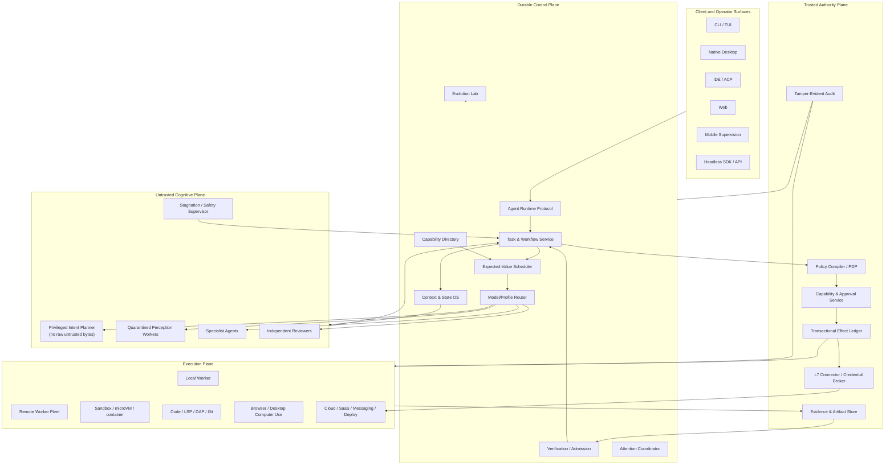
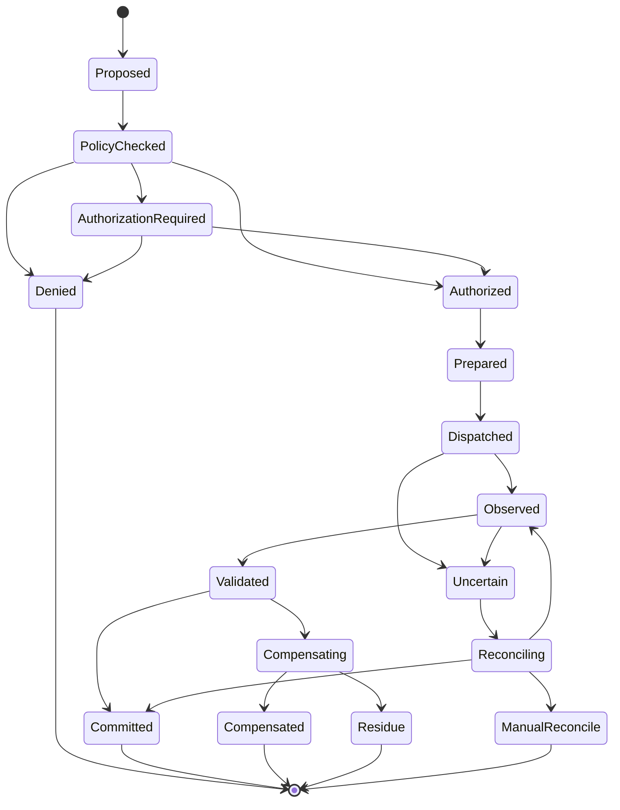

# North-Star Architecture: Terminus Agent Operating System

## 1. Architectural thesis

Terminus should become a universal **Agent Operating System** whose center is a durable, typed task and effect runtime—not a chat application and not a wrapper around one provider’s agent loop.

The architecture is built on a strict division of responsibility:

> **Models propose, interpret and judge. Typed workflows coordinate. A trusted kernel authorizes and performs effects. Independent verifiers admit claims. Durable state makes execution resumable. The operator controls intent, authority and attention.**

This division allows Terminus to be simultaneously:

- more capable, because models can dynamically plan and create workflows;
- more reliable, because deterministic controllers own state transitions;
- more secure, because models and extensions have no ambient authority;
- more efficient, because context, tools and models are activated just in time;
- more usable, because one task persists across every client and environment;
- more improvable, because every component and decision is observable and evaluable.

## 2. System overview



## 3. Core invariants

1. **The task is the system of record.** Chat messages are inputs and views, not authoritative state.
2. **No model, extension, adapter or MCP server has ambient authority.**
3. **Every effect has a durable lifecycle and identity.**
4. **Every authorization is bound to an exact intent, scope, principal, task, effect and validity epoch.**
5. **No raw credential is exposed to a model or general-purpose tool runtime.**
6. **Untrusted observations do not enter the privileged planner as raw bytes by default.**
7. **Candidate state is not authoritative until validated and admitted.**
8. **Every completion claim resolves to exact evidence or is explicitly uncertain.**
9. **Every client speaks the same versioned runtime protocol.**
10. **Every support/security claim is generated from current conformance evidence.**
11. **A task can survive client, worker, model-provider and control-process failure.**
12. **No company-wide root agent is required. Organizational autonomy is federated.**

## 4. Canonical entities

### 4.1 Organization and capability topology

- **Organization:** policy, identity and resource boundary.
- **Department:** inherited policy and persistent operator scope.
- **Operator Agent:** durable departmental coordinator with bounded authority.
- **Worker Profile:** ephemeral or persistent specialist definition.
- **Capability Directory:** deterministic registry mapping requested capabilities and resource domains to eligible operators, workers, tools and connectors.
- **Collaboration Edge:** explicit operator-to-operator task, question, artifact or approval exchange.

There is no universal root operator. A task originates with the operator whose capability/resource scope best matches it. Cross-department work is represented as typed tasks and handoffs, not hidden delegation.

### 4.2 Work entities

- **Mission:** user/business objective with acceptance criteria.
- **Task:** durable unit of work and authority.
- **Workflow:** typed graph of deterministic and model-owned nodes.
- **Attempt:** one execution lineage under pinned model/profile/environment versions.
- **Node Run:** one workflow-node execution.
- **Claim:** proposition asserted about outcome or state.
- **Evidence:** immutable observation supporting or refuting a claim.
- **Artifact:** content-addressed output.
- **Decision:** recorded choice with alternatives, rationale and provenance.
- **Question:** a missing decision whose answer can materially change the task.
- **Risk:** tracked uncertainty or possible harm.
- **Effect:** proposed mutation of local or external state.
- **Authorization Instance:** exact grant permitting an effect or bounded effect family.
- **Sandbox Lease:** execution environment identity, policy and lifetime.
- **Resource Handle:** typed reference with version, authority and provenance.

### 4.3 Identity separation

The system distinguishes:

- human principal;
- organization/department operator;
- task identity;
- attempt identity;
- model invocation identity;
- workflow identity;
- worker identity;
- sandbox identity;
- connector identity;
- extension identity;
- effect identity;
- verifier identity.

A reviewer never silently inherits the actor’s authority.

## 5. Agent Runtime Protocol

The Agent Runtime Protocol (ARP) is the canonical internal contract. It is richer than ACP, MCP or A2A and can adapt to each.

### 5.1 Protocol properties

- schema-first and versioned;
- bidirectional streaming;
- resumable cursors;
- idempotent command IDs;
- optimistic concurrency via expected versions;
- explicit backpressure;
- typed errors and retry classifications;
- capability negotiation;
- content-addressed large payload references;
- no transport-specific semantics;
- generated clients for Rust, TypeScript, Swift, Kotlin and Python.

### 5.2 Protocol domains

- organization/capability directory;
- mission/task/workflow;
- context/evidence/artifacts;
- model invocation;
- effects/authorization/approvals;
- sandbox/process/browser/computer use;
- verification/admission;
- collaboration/attention;
- observability/replay;
- evaluation/evolution.

### 5.3 Client semantics

Every client is a projection of the same task:

- CLI can start locally and detach;
- desktop can adopt and visualize it;
- IDE can contribute selection/editor state;
- mobile can approve or pause;
- web can supervise remote workers;
- SDK can automate without losing audit or policy semantics.

Client-native tools, such as IDE selection or native file reveal, are represented as scoped capabilities with explicit provenance.

## 6. Durable task and workflow service

### 6.1 Storage model

Use a hybrid model:

- append-only semantic event log;
- transactional materialized state;
- immutable content-addressed artifacts;
- versioned checkpoints;
- analytics export to Parquet/OpenTelemetry;
- JSONL/ATIF export for portability.

Do not replay stdout bytes to reconstruct business state. Do preserve exact raw streams as artifacts when needed.

### 6.2 Workflow ownership

The controller owns traversal. A model may:

- propose a graph;
- refine a graph;
- choose among allowed outgoing edges;
- fill a typed judgment slot;
- request a bounded loop;
- propose a new subworkflow.

It may not mutate authoritative workflow state directly.

### 6.3 Durable execution

A workflow command follows:

1. receive idempotent command;
2. validate expected state/version;
3. append intent;
4. commit materialized transition and outbox atomically;
5. dispatch to worker/model/effect service;
6. ingest result through idempotent inbox;
7. validate;
8. commit or enter uncertainty/recovery.

Every worker operation has a lease and fencing epoch. A stale worker cannot commit after lease loss.

## 7. Transactional Effect Ledger

The Effect Ledger is the most important differentiator.

### 7.1 Lifecycle



### 7.2 Effect classes

- **Read-only:** no external mutation.
- **Bufferable local:** isolated workspace mutation; admitted later.
- **Reversible external:** exact inverse is available.
- **Compensable external:** compensation exists but may leave residue.
- **Irreversible:** cannot be undone.
- **Unknown semantics:** connector cannot establish safe retry/compensation; requires stricter approval.

### 7.3 Semantic idempotency

Keys are derived from task intent and effect semantics, not request UUIDs. They survive:

- retries;
- replanning;
- worker restarts;
- provider changes;
- subagent handoff;
- client detach/reattach.

### 7.4 Authorization consumption

An authorization instance is consumed through the ledger:

- bound to effect ID or declared bounded family;
- prepared and consumed atomically;
- use count and epoch durable;
- cannot be replayed after revocation or task-version change;
- approval text shown to the user is hash-bound to executed semantics;
- material changes require a new authorization.

### 7.5 Verify before retry

On timeout or crash, the connector performs a read/reconciliation operation. Retry is allowed only when non-execution is established or the API offers an idempotency contract.

## 8. Trusted authority plane

### 8.1 Policy compiler

Policies compile organization, department, project, task, mode and user overrides into an effective policy artifact.

The UI shows:

- inherited rules;
- local overrides;
- denied capabilities;
- effective diff;
- enforcement status;
- evidence expiry.

Policies cover sequences, not only individual calls. Examples:

- code may be uploaded only after local secret scan;
- a deployment requires tests and approval from a different principal;
- browser content cannot directly cause credentialed navigation;
- a reviewer cannot merge its own recommendation.

### 8.2 Object capabilities

Authority is attached to typed handles:

`Handle<ObjectId, ObjectType, Version, Scope, Operations, Principal, Epoch, Provenance>`

Examples:

- workspace snapshot handle;
- Git ref handle;
- browser tab handle;
- database query handle;
- secret-use handle;
- deployment target handle;
- artifact handle.

Handles are attenuable and revocable. Serialization does not create authority.

### 8.3 Secret and connector broker

The model requests an operation such as:

```text
github.create_pull_request(
  repo = RepoHandle(...),
  head = GitRefHandle(...),
  base = "main",
  title = "...",
  body_artifact = ArtifactHandle(...)
)
```

The broker:

- validates intent and authorization;
- obtains or mints a short-lived credential;
- injects it inside the trusted connector;
- performs exact L7 request(s);
- redacts sensitive fields;
- records request/response hashes and semantic outcome;
- returns typed non-secret data.

General tools never receive the credential.

## 9. Trust-separated cognition

### 9.1 Roles

- **Intent Planner:** sees user intent, trusted policy, typed facts and bounded evidence; does not ingest raw untrusted text by default.
- **Perception Workers:** inspect repository files, logs, web pages, browser trees, documents and tool descriptors in quarantine.
- **Specialists:** solve bounded technical subproblems.
- **Independent Reviewers:** verify claims and artifacts with clean context.
- **Stagnation Supervisor:** monitors progress, loops, uncertainty, novelty and resource burn.
- **Safety Supervisor:** can pause or narrow authority based on sequence-level risk.

### 9.2 Typed fact extraction

Perception produces:

- fact value;
- source handle;
- exact span/range;
- parser/extractor identity;
- confidence;
- trust label;
- taint;
- contradiction set.

The planner may request the exact source when necessary, but that is an explicit trust-boundary crossing.

### 9.3 Prompt injection defense

No text, including repository instructions, tool descriptions, skill files or browser content, is intrinsically authoritative. Authority derives from signed policy and user/task intent.

Potential instructions in untrusted content are represented as quoted evidence, not automatically promoted to system instructions.

## 10. Context and State OS

### 10.1 Five tiers

1. **Immutable Evidence Store**  
   Raw logs, files, screenshots, DOM/accessibility snapshots, tool results, external receipts and source spans.

2. **Executable World Model**  
   Recomputed repository state, process state, dependency graph, plan status, effect status, environment identity, test state and known contradictions.

3. **Repository and Domain Views**  
   Lexical/semantic index, AST, symbol/reference graph, build graph, ownership, history, runtime topology and business-domain entities.

4. **Memory Views**  
   Episodic outcomes, semantic facts, procedural workflows, user/org preferences and failure lessons with provenance, confidence, scope and expiry.

5. **Prompt Projection**  
   Provider-specific, task-phase-specific context IR rendered for one model invocation.

### 10.2 Context compiler

Inputs:

- task contract;
- workflow node;
- current world state;
- model profile;
- tool/capability set;
- risk level;
- cache state;
- evidence candidates;
- token/latency budget.

Outputs:

- typed Context IR;
- provider rendering;
- exact manifest;
- omitted-candidate list;
- trust/taint map;
- stable-prefix hash;
- predicted cache behavior;
- retrieval rationale.

### 10.3 Semantic compaction

Compaction produces claims linked to expandable evidence. It preserves:

- task and acceptance criteria;
- decisions and rejected alternatives;
- unresolved questions;
- failures and attempted fixes;
- effect and approval state;
- recent complete tool episodes;
- exact code/policy/schema artifacts by reference.

No lossy summary can replace policy, code, a patch, schema or approval semantics.

### 10.4 Memory admission

Memory is admitted only when:

- useful beyond the current turn;
- supported by evidence;
- scoped to user/project/org/global;
- confidence and expiry are assigned;
- sensitive data is excluded or separately protected;
- contradictions are tracked;
- deletion and correction are possible.

Global harness evolution is separate from user memory.

## 11. Agent–computer interface

### 11.1 Core tool philosophy

A small stable core is always available:

- `inspect`
- `search`
- `read`
- `propose_patch`
- `apply_patch_transaction`
- `run`
- `job`
- `diagnostics`
- `verify`
- `artifact`
- `capabilities`
- `workflow`
- `decision`

Specialized capabilities—browser, debugger, databases, cloud, issue trackers—are loaded progressively.

### 11.2 Reads and search

Results include:

- source version/hash;
- bounded inline content;
- immutable artifact spill;
- continuation cursor;
- trust/provenance;
- structural location;
- omitted count.

Repository retrieval combines lexical, semantic, AST, symbol/reference, build graph, ownership and history signals. Ranking is model/profile and task-phase specific.

### 11.3 Editing

Support multiple model-specific edit dialects behind canonical transactions:

- hash-anchored hunks;
- structured AST transformations;
- search/replace with expected versions;
- whole-file replacement for small files;
- IDE-native edits;
- model-specific formats proven by eval.

Every transaction uses an isolated candidate snapshot. It may permit transient invalidity internally, but admission requires configured parser, diagnostic, test, scope and semantic-diff predicates.

### 11.4 Code intelligence

First-class:

- LSP;
- DAP;
- compiler diagnostics;
- test impact;
- call/reference graph;
- code ownership;
- dependency and build graph;
- runtime traces;
- generated-code awareness;
- database/schema migration analysis.

### 11.5 Computer use

Computer-use actions operate on versioned UI state:

- screenshot;
- accessibility/DOM tree;
- focused element;
- window/tab identity;
- coordinate transform;
- input action;
- resulting observation.

High-risk actions require semantic target verification, not coordinates alone. The system records before/after visual evidence and reconciles ambiguous submissions.

## 12. Workflow and skill compiler

### 12.1 Sources

- human-authored workflows;
- natural-language skill documents;
- model-generated task workflows;
- imported CI/SOP/playbook definitions;
- reusable organizational procedures.

### 12.2 Workflow IR

Nodes declare:

- typed inputs/outputs;
- owner: deterministic code, model judgment, human, connector or verifier;
- required capabilities;
- trust level;
- side-effect class;
- preconditions/postconditions;
- retries and timeout;
- compensation;
- resource budget;
- evidence requirements;
- allowed successors.

### 12.3 Static validation

The compiler checks:

- schema and type correctness;
- handle scope and lifetime;
- reachability and dead ends;
- bounded loops;
- mandatory-step coverage;
- policy gates and separation of duties;
- taint paths;
- temporal safety;
- authority attenuation;
- effect order;
- idempotency and compensation;
- resource budgets;
- trust-boundary crossings;
- verifier independence;
- source-to-IR provenance.

### 12.4 Owner test

If a decision is mechanically derivable from typed inputs, code owns it. If it requires taste, ambiguity resolution or open-world judgment, a model owns a typed slot. This prevents both brittle automation and uncontrolled agentic traversal.

## 13. Model profiles and router

### 13.1 Model profile

A versioned profile includes:

- provider/model identity;
- context layout;
- stable cache prefix;
- tool dialect and schema ordering;
- edit formats;
- continuation/compaction strategy;
- reasoning-effort policy;
- known failure patterns;
- structured-output repair;
- concurrency limits;
- cost and latency model;
- benchmark posterior by task cohort;
- safety and data-residency constraints.

### 13.2 Stage-aware routing

Routing occurs per workflow node, not once per task:

- fast model for classification/retrieval triage;
- strong coding model for implementation;
- vision/computer-use model for UI;
- independent model family for review;
- local model for private or low-risk work;
- deterministic code when no model is needed.

Start with rules and measured posteriors. Learned routing is promoted only after held-out improvement.

### 13.3 Provider failure

Model invocations are restartable units with:

- exact input manifest;
- profile/version;
- tool/capability state;
- continuation handle where supported;
- bounded retry policy;
- fallback that does not silently change authority or evidence standards.

## 14. Expected-value multi-agent scheduling

### 14.1 No default swarm

The scheduler estimates:

- expected information gain;
- specialization advantage;
- parallel speedup;
- token/compute cost;
- context construction cost;
- coordination and review cost;
- write-conflict risk;
- security exposure;
- deadline value.

### 14.2 Work isolation

- read-only scouts may share immutable snapshots;
- writers receive separate branches/worktrees/filesystem layers;
- only the admission service merges;
- each branch has a resource frontier and effect epoch;
- losing speculative branches cannot commit effects;
- artifacts and findings remain reusable after branch rejection.

### 14.3 Federated organization

Department operators collaborate directly. The capability directory resolves unknown destinations deterministically. Handoffs contain:

- task contract;
- input handles;
- requested output schema;
- authority ceiling;
- deadline/budget;
- evidence requirements;
- return route.

No root agent becomes a bottleneck or universal compromise point.

## 15. Verification and admission

### 15.1 Claim graph

Completion is a graph:

`claim -> evidence -> verifier -> environment -> policy -> admission`

Claims can be:

- satisfied;
- refuted;
- partially supported;
- blocked;
- uncertain;
- waived by named authority with rationale.

### 15.2 Verification DAG

Predicates include:

- exact checkout/environment identity;
- scope;
- parser/typecheck/lint;
- targeted tests;
- broader regression tests;
- security/static analysis;
- semantic diff;
- runtime behavior;
- browser/UI visual acceptance;
- performance;
- migration/rollback;
- external-effect receipt/reconciliation.

The DAG is task-specific. A documentation task should not inherit a fixed nine-stage ladder.

### 15.3 Clean-context review

Reviewers receive:

- task and acceptance criteria;
- candidate artifact/diff;
- selected evidence;
- risk model;
- no actor self-justification unless explicitly requested;
- no ability to commit by default.

### 15.4 Admission

Only the admission service can:

- update authoritative workspace;
- merge branches;
- mark claims satisfied;
- commit external effects;
- publish/deploy/release.

## 16. Operator cockpit

### 16.1 Primary views

- organizational capability map;
- department workspace;
- agent rooms;
- mission and acceptance ledger;
- editable workflow graph;
- live world state;
- risk and effect queue;
- claim-to-evidence graph;
- artifact/diff inspector;
- terminal/browser/sandbox view;
- fleet and budget;
- causal replay;
- memory and policy diff.

### 16.2 Attention coordinator

The coordinator asks only when:

- interpretations materially diverge;
- authority must expand;
- risk becomes irreversible or externally visible;
- a required secret/OAuth grant is absent;
- human taste is the acceptance criterion;
- confidence falls below policy threshold.

It batches related questions and shows consequences of each answer.

### 16.3 Intervention

Structured interventions:

- focus;
- ignore;
- elaborate;
- change constraint;
- edit plan;
- approve exact effect;
- deny/narrow;
- pause;
- resume;
- takeover;
- fork;
- rewind;
- terminate;
- request independent review.

The UI exposes decisions, state, evidence and uncertainty—not hidden chain of thought.

## 17. Extensions and ecosystem

### 17.1 Extension types

- model profiles;
- tools/connectors;
- workflows/skills;
- verifiers;
- repository/domain indexers;
- UI panels;
- adapters;
- policy packs.

### 17.2 Trust

Every extension is:

- signed;
- identity/version/hash bound;
- declarative about capabilities and data flows;
- isolated out of process or in WASM/microVM;
- tested against conformance suites;
- revocable;
- reproducibly packaged;
- assigned a trust tier.

Descriptor changes invalidate prior authorization.

### 17.3 Compatibility adapters

ACP, MCP, A2A, AG-UI/A2UI and ATIF adapters preserve external compatibility while translating into canonical handles, trust labels, effects and evidence.

## 18. Deployment topology

### 18.1 Local-first

A local daemon provides:

- task cache;
- local model/provider access;
- local worker;
- IDE/CLI/native clients;
- encrypted local artifact store;
- offline mode;
- optional sync to managed control plane.

### 18.2 Managed fleet

- multi-region durable control plane;
- prewarmed development environments;
- microVM and hardened container workers;
- GPU/browser/desktop pools;
- organization policy and identity;
- encrypted artifact/evidence storage;
- workload identities;
- regional data residency;
- autoscaling and fair scheduling.

### 18.3 Hybrid execution

One workflow can use:

- local source and editing;
- remote build/test;
- managed browser;
- local/private model;
- hosted reviewer;
- enterprise connector broker.

Handles and policy determine allowed movement; raw data is not copied merely because compute moves.

## 19. Observability and causal replay

Capture:

- component configuration;
- model input manifest and output;
- retrieval candidates and choices;
- tool/effect lifecycle;
- workflow transitions;
- policy and authorization decisions;
- evidence and verifier output;
- user interventions;
- resource/cost/latency;
- cache behavior;
- failures and recovery decisions.

Causal replay can ask:

- which component caused this behavior?
- what would happen with a different profile?
- did a context omission cause the error?
- did the model or harness choose the wrong action?
- did a retry duplicate an effect?
- which user intervention changed the result?

Sensitive raw content is access-controlled and may be locally retained while derived trace metadata is shared.

## 20. Evolution Lab

### 20.1 Editable components

- prompts and context renderers;
- retrieval/ranking;
- tool schemas;
- edit dialects;
- middleware;
- routing;
- memory admission;
- workflow templates;
- orchestration policy;
- verifier selection;
- UI check-in policy;
- cache layout.

### 20.2 Candidate contract

Every proposed change includes:

- source failures and supporting traces;
- root-cause attribution;
- targeted component;
- forbidden components;
- predicted fixes;
- predicted regressions;
- cost/latency effect;
- security/privacy effect;
- required tests.

### 20.3 Promotion

1. static validation;
2. unit/simulation;
3. replay on relevant failures;
4. small held-out cohort;
5. broad held-out matrix;
6. security and chaos;
7. Pareto comparison;
8. signed candidate;
9. canary;
10. production monitoring;
11. automatic rollback on violated prediction.

The optimizer cannot read hidden tests or alter graders, budgets or promotion policy.

## 21. Why this architecture wins

Against minimal harnesses, it preserves a permanent minimal mode but adds evidence-backed capability only when beneficial.

Against vertically integrated products, it matches model-native optimization without vendor lock-in.

Against open client/server harnesses, it adds durable semantic effects, trust separation and formal workflow execution.

Against swarm systems, it coordinates only when expected value is positive.

Against enterprise agents, it provides stronger local power-user UX and open trusted primitives.

Against research harnesses, it turns self-improvement into a production-controlled process.

The intended advantage is not “more features.” It is **coherence**: every feature participates in the same typed task, authority, effect, evidence and durability model.
